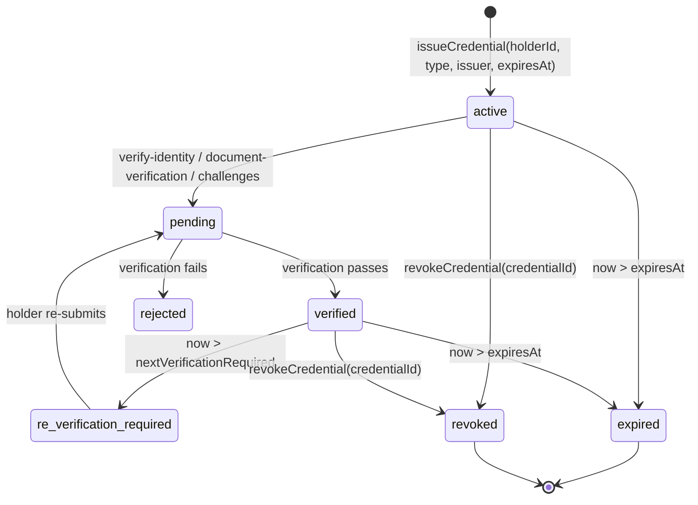
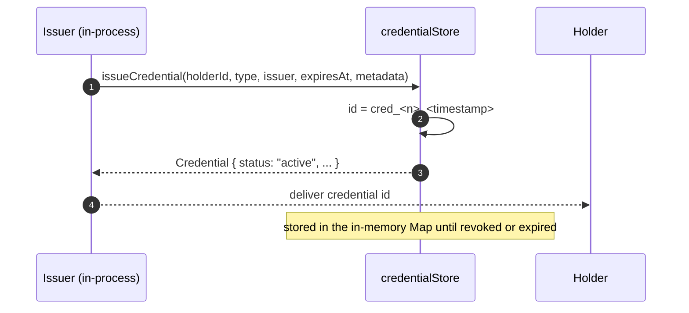
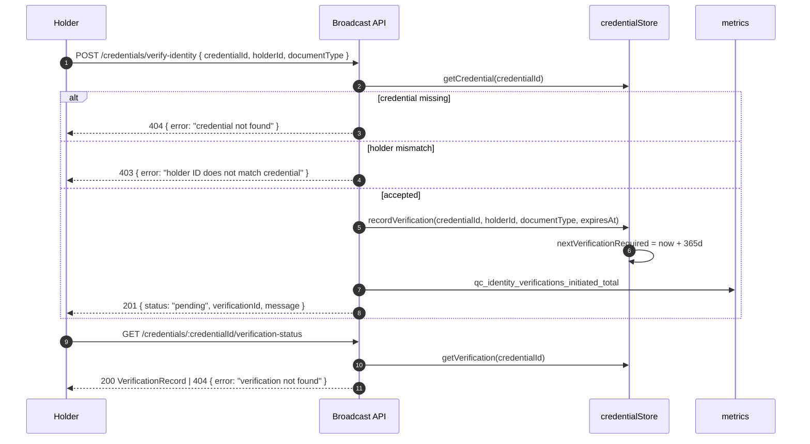
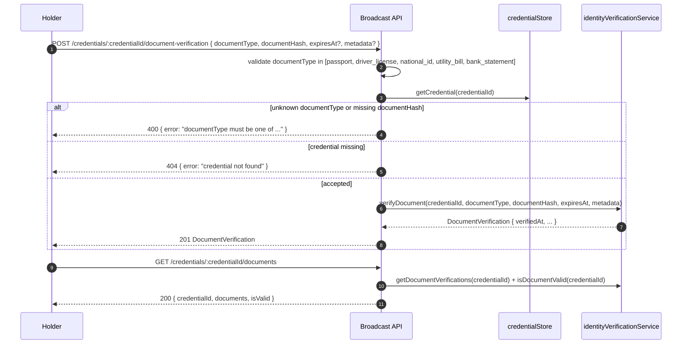
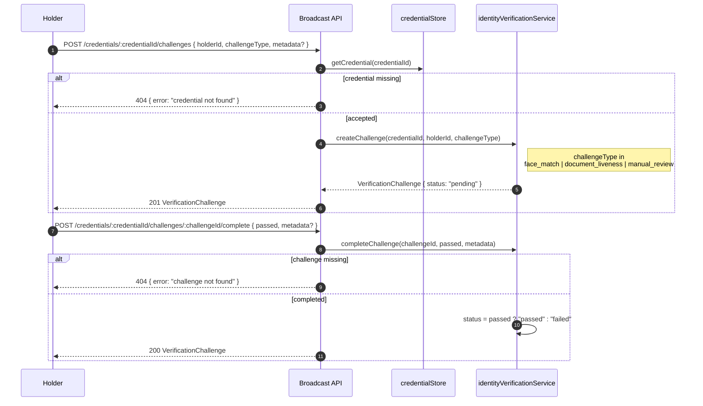
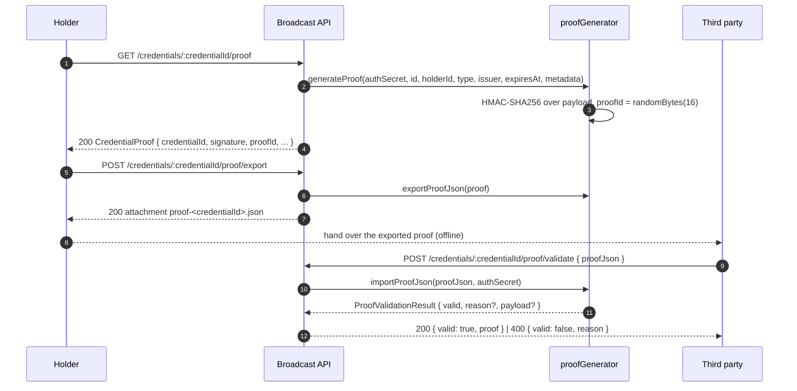
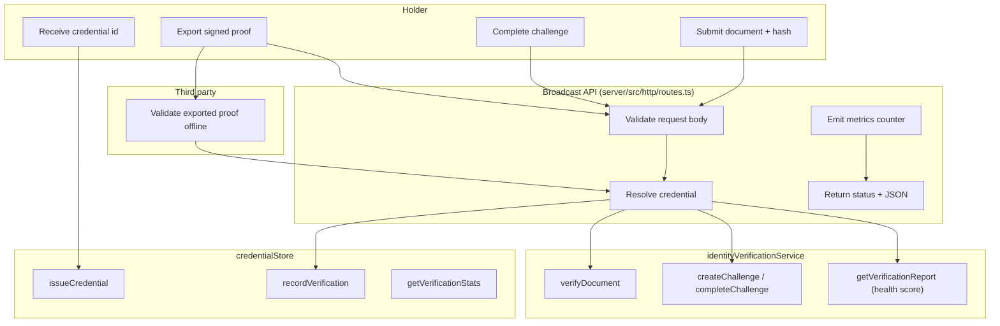

# Credential Flow — Sequence, Swimlane and API Call Sequences

This guide walks the end-to-end life of a credential in QuorumCredit: how one is
issued, how it is verified (identity, documents, challenges), how a holder proves
it to a third party offline, and which HTTP calls each step performs.

It complements:

- [`docs/credential-policy-guide.md`](credential-policy-guide.md) — capability tiers and thresholds
- [`docs/CREDENTIAL_METADATA_ENCRYPTION.md`](CREDENTIAL_METADATA_ENCRYPTION.md) — metadata encryption
- [`docs/credential-privacy-policy.md`](credential-privacy-policy.md) — privacy helpers

> All diagrams below are [Mermaid](https://mermaid.js.org/) and render inline in
> the GitHub UI (pan/zoom is available from the viewer). They are generated from
> the same source of truth as the code, so they stay editable as text alongside
> the implementation rather than as exported images.

## Actors

| Actor | Description | Code |
|-------|-------------|------|
| **Holder** | The subject a credential is issued to; submits documents and challenges | `Credential.holderId` |
| **Issuer** | Issues credentials for a holder | `credentialStore.issueCredential(...)` |
| **Broadcast API** | The QuorumCredit Node server that exposes the credential HTTP surface | `server/src/http/routes.ts` |
| **Credential store** | In-memory credential + verification records | `server/src/credentials/credentialStore.ts` |
| **Identity service** | Document verification, challenges, health scoring | `server/src/credentials/identityVerificationService.ts` |
| **Proof generator** | Signs and validates exportable credential proofs | `server/src/credentials/proofGenerator.ts` |
| **Third party** | Consumes an exported proof without API access | `POST /credentials/:credentialId/proof/validate` |

## Credential Lifecycle

`nextVerificationRequired` is set **365 days** after each recorded verification
(`credentialStore.recordVerification`), independent of the credential's own
`expiresAt`.

## Sequence 1 — Credential Issuance

Credential issuance is an **in-process call**, not an HTTP endpoint: the store
exposes `issueCredential` / `revokeCredential`, and there is currently no REST
route that wraps them. Verification and proof endpoints (below) are the HTTP
surface.

## Sequence 2 — Identity Verification

## Sequence 3 — Document Verification

## Sequence 4 — Challenge-Based Verification

## Sequence 5 — Proof Export and Third-Party Validation

## Swimlane — Who Does What

## API Call Sequences

All paths below are relative to the server root (the router has **no** `/api/v1`
prefix). `:credentialId` / `:holderId` segments are URL-decoded before lookup.

### Proof endpoints

| Step | Method | Path | Request | Success | Errors |
|------|--------|------|---------|---------|--------|
| 1 | `GET` | `/credentials/:credentialId/proof` | — | `200 CredentialProof` | `404 credential not found` |
| 2 | `POST` | `/credentials/:credentialId/proof/export` | — | `200` JSON attachment `proof-<credentialId>.json` | `404 credential not found` |
| 3 | `POST` | `/credentials/:credentialId/proof/validate` | `{ proofJson: string }` | `200 { valid: true, reason, proof }` | `400 { error: "proofJson required" }`, `400 { valid: false, reason }` |

### Verification endpoints

| Step | Method | Path | Request | Success | Errors |
|------|--------|------|---------|---------|--------|
| 4 | `POST` | `/credentials/verify-identity` | `{ credentialId, holderId, documentType }` | `201 { status: "pending", verificationId }` | `400 missing fields`, `403 holder mismatch`, `404 credential not found` |
| 5 | `GET` | `/credentials/:credentialId/verification-status` | — | `200 VerificationRecord` | `404 verification not found` |
| 6 | `GET` | `/credentials/:holderId/verify-all` | — | `200 { stats, credentialsNeedingReVerification }` | — |
| 7 | `POST` | `/credentials/:credentialId/document-verification` | `{ documentType, documentHash, expiresAt?, metadata? }` | `201 DocumentVerification` | `400 invalid documentType / documentHash`, `404 credential not found` |
| 8 | `GET` | `/credentials/:credentialId/documents` | — | `200 { credentialId, documents, isValid }` | — |
| 9 | `POST` | `/credentials/:credentialId/challenges` | `{ holderId, challengeType, metadata? }` | `201 VerificationChallenge` | `404 credential not found` |
| 10 | `POST` | `/credentials/:credentialId/challenges/:challengeId/complete` | `{ passed, metadata? }` | `200 VerificationChallenge` | `404 challenge not found` |
| 11 | `GET` | `/credentials/:credentialId/verification-report` | — | `200 report { verificationScore, status }` | — |

`GET /credentials/:credentialId/verification-report` returns
`{ credentialId, documents, schedule, challenges, verificationScore, isReVerificationDue, status, lastUpdated }`.
`status` is derived from `verificationScore`
(`identityVerificationService.getVerificationScore`): `score >= 80 → verified`,
`score >= 50 → at_risk`, otherwise `failed`.

### Holder analytics endpoints

| Step | Method | Path | Request | Success |
|------|--------|------|---------|---------|
| 12 | `GET` | `/analytics/credentials/:holderId` | — | `200 dashboard data` |
| 13 | `GET` | `/analytics/credentials/:holderId/stats` | — | `200 { credentialStats, verificationStats, topTypes, healthScore }` |
| 14 | `GET` | `/analytics/credentials/:holderId/trends?days=<n>` | — | `200 { holderId, days, trends }` |
| 15 | `POST` | `/analytics/credentials/:holderId/record-trend` | `{ credentials, verified, pending, avgVerificationScore? }` | `201 { message }` |
| 16 | `GET` | `/analytics/metrics` | — | `200 usage metrics` |

### Verification status values

| Field | Source | Values |
|-------|--------|--------|
| `VerificationRecord.verificationStatus` | `credentialStore` | `pending`, `verified`, `rejected`, `re_verification_required` |
| `VerificationChallenge.status` | `identityVerificationService` | `pending`, `passed`, `failed` |
| `Credential.status` | `credentialStore` | `active`, `revoked`, `expired`, `suspended` |

## Metrics Emitted

Every step bumps a counter through `server/src/http/metricsRegistry.ts`, which is
what the dashboards in `observability/` consume:

| Counter | Emitted by |
|---------|------------|
| `qc_proofs_generated_total` | `GET .../proof` |
| `qc_proofs_exported_total` | `POST .../proof/export` |
| `qc_proofs_validated_total` | `POST .../proof/validate` |
| `qc_identity_verifications_initiated_total` | `POST /credentials/verify-identity` |
| `qc_verification_status_checks_total` | `GET .../verification-status` |
| `qc_verification_stats_total` | `GET .../verify-all` |
| `qc_documents_verified_total` | `POST .../document-verification` |
| `qc_documents_queried_total` | `GET .../documents` |
| `qc_verification_challenges_created_total` | `POST .../challenges` |
| `qc_verification_challenges_passed_total` / `..._failed_total` | `POST .../challenges/:id/complete` |
| `qc_verification_reports_generated_total` | `GET .../verification-report` |
| `qc_analytics_dashboard_generated_total` | `GET /analytics/credentials/:holderId` |

## Known Boundaries

- `credentialStore` is **in-memory**; the module header states production would
  back it with a database. Verification records therefore do not survive a
  restart.
- Issuance and revocation exist on the store (`issueCredential`,
  `revokeCredential`) but are **not** exposed over HTTP yet, so they are shown as
  in-process steps rather than endpoints.
- `recordVerification` keys records by a generated `verificationId` while
  `getVerification` looks up by `credentialId`; the flow above therefore assumes
  one active verification record per credential.
